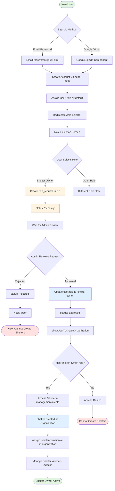

This is a [Next.js](https://nextjs.org) project bootstrapped with [`create-next-app`](https://nextjs.org/docs/app/api-reference/cli/create-next-app).

## Getting Started

First, run the development server:

```bash
npm run dev
# or
yarn dev
# or
pnpm dev
# or
bun dev
```

Open [http://localhost:3000](http://localhost:3000) with your browser to see the result.

You can start editing the page by modifying `app/page.tsx`. The page auto-updates as you edit the file.

This project uses [`next/font`](https://nextjs.org/docs/app/building-your-application/optimizing/fonts) to automatically optimize and load [Geist](https://vercel.com/font), a new font family for Vercel.

## Learn More

To learn more about Next.js, take a look at the following resources:

- [Next.js Documentation](https://nextjs.org/docs) - learn about Next.js features and API.
- [Learn Next.js](https://nextjs.org/learn) - an interactive Next.js tutorial.

You can check out [the Next.js GitHub repository](https://github.com/vercel/next.js) - your feedback and contributions are welcome!

## Google OAuth Setup for Better Auth

To enable Google authentication with Better Auth, you need to obtain Google OAuth credentials and store them securely:

1. Go to [Google Cloud Console](https://console.cloud.google.com/apis/credentials).
2. Create a new project (if needed).
3. Set up the OAuth consent screen (add app info, authorized domains, etc.).
4. Create OAuth 2.0 credentials:
   - Go to "Credentials" → "Create Credentials" → "OAuth client ID".
   - Choose "Web application".
   - Set authorized redirect URIs (`http://localhost:3000/api/auth/callback/google` for local development).
   - Save and copy your **Client ID** and **Client Secret**.
5. Add these credentials to your `.env` file:

```env
GOOGLE_CLIENT_ID=your-google-client-id
GOOGLE_CLIENT_SECRET=your-google-client-secret
```

These environment variables are used by Better Auth to enable Google login. Do not commit your `.env` file to version control.

## Authentication Flow for Shelter Owners

The following diagram illustrates the complete authentication and authorization flow for users who want to become shelter owners in the application:



### Key Steps in the Flow:

1. **Sign Up** - Users can sign up via:

   - Email/Password (`EmailPasswordSignupForm`)
   - Google OAuth (`GoogleSignUp`)
   - Initial role assigned: `"user"`

2. **Role Selection** (`/role-selector`):

   - User redirected to role selection screen
   - Creates a `role_request` with `status: "pending"`
   - Request includes reason for requesting shelter owner role

3. **Admin Approval** (`/users/role-requests`):

   - Site admin reviews the request
   - Updates `status` to `"approved"` or `"rejected"`
   - If approved, user's role updated to `"shelter-owner"`

4. **Organization Creation** (`allowUserToCreateOrganization`):

   - Permission check verifies user has `shelter-owner` role
   - Only shelter owners can create organizations (shelters)

5. **Shelter Management** (`/shelters-management/create`):
   - Organization created with the shelter owner
   - `beforeAddMember` hook assigns `shelter-owner` role to organization owner
   - Shelter owner can manage animals, admins, and other shelter data

The flow enforces a gated approval process where shelter owners must be verified by site administrators before they can create and manage shelters in the system.

## Deploy on Vercel

The easiest way to deploy your Next.js app is to use the [Vercel Platform](https://vercel.com/new?utm_medium=default-template&filter=next.js&utm_source=create-next-app&utm_campaign=create-next-app-readme) from the creators of Next.js.

Check out our [Next.js deployment documentation](https://nextjs.org/docs/app/building-your-application/deploying) for more details.
